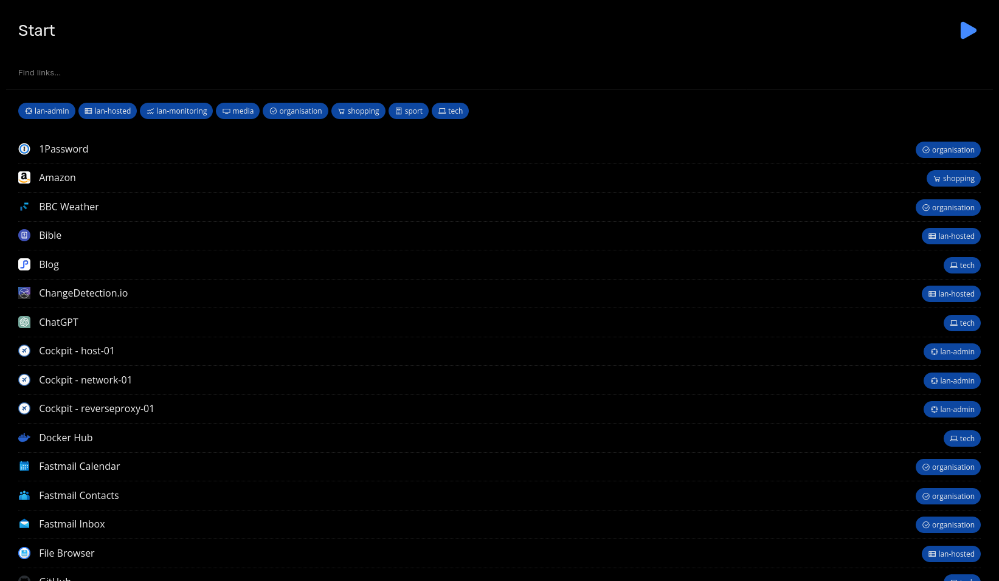

# Start

My personal start/home/new-tab page with a searchable list of my most visited links/bookmarks.



## Dependencies

The search feature is powered by, and completely dependant on [Typesense](https://typesense.org/), and uses the excellent [typesense-instantsearch-adapter](https://github.com/typesense/typesense-instantsearch-adapter). I have a Docker container running Typesense that the application code talks too. Complete overkill really, and long-term I may look at using something like [Fuse.js](https://fusejs.io/).

I also know very little about Javascript, so it's all a bit bodged together, but it works and, I think, looks nice - so who cares!

## Configuration

`config_template.yml` should be renamed to `config.yml` and variables updated.

## Search-Only API Key

**Warning** - There's a publically accessible API key that will be viewable if you host this on the web. It's in a file that's created by `main.py` called `typesense_adaptor.js`. The key is scoped to have search-only permissions, so it doesn't give any risky access out. 

If you were to host the site on the public internet, somebody could try and bring down your Typesense server by overwhelming it with `curl` requests, but I don't much care at the moment, because I host the application locally on my LAN, and via Tailscale for when I'm out and about - so it's not an issue for me right now. In the long-term I'll come up with a better solution, but for now I don't really mind. 

## Usage

The `links_template.yml` should be renamed to `links.yml` and serves as a list of bookmarks to index and add to the webpage. It's easy enough to add links, just follow the format below.

```yml
- title: Brave Search
  url: https://search.brave.com
  category: organisation
  tags: [search]
- title: Fastmail Inbox
  url: https://app.fastmail.com
  category: organisation
  tags: [email, mail]
```

After adding links, you need to run the `main.py` script to import them into Typesense, and then you can refresh the webpage to see the latest list of links. This script should be run after any changes to colours defined in the `config.yml` file as well, as it rebuilds the webpage.

```sh
python3 main.py
```

You'll need to serve the `public/` directory up using a webserver. I use [Caddy](https://caddyserver.com/).

